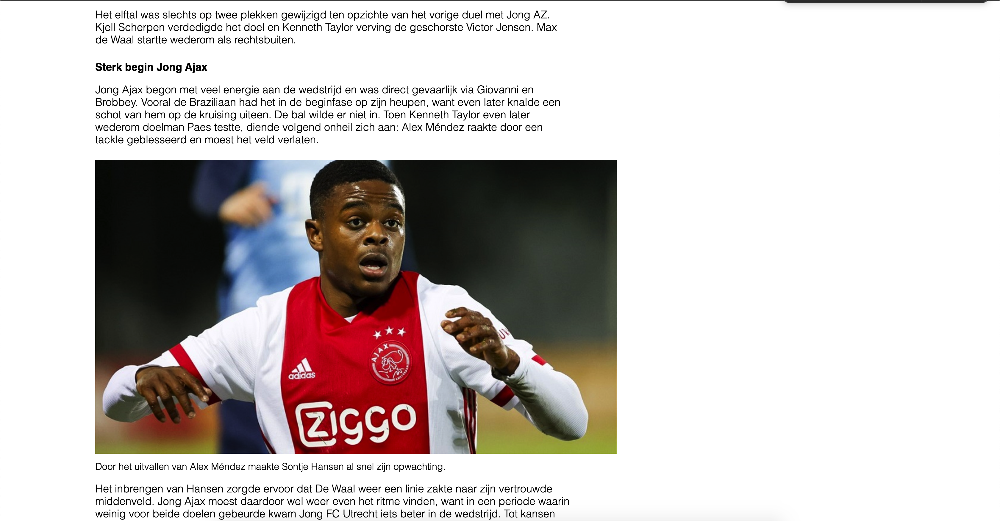
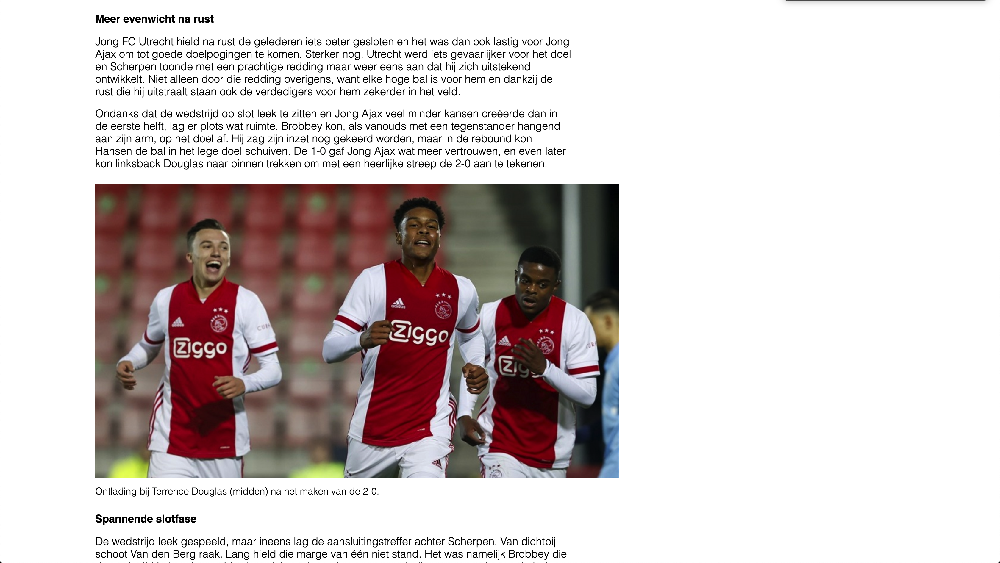
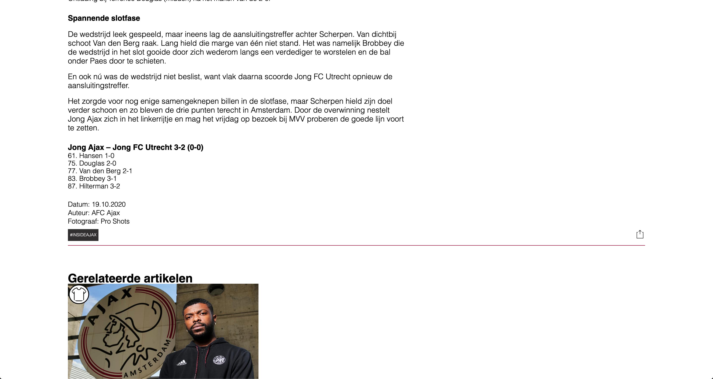
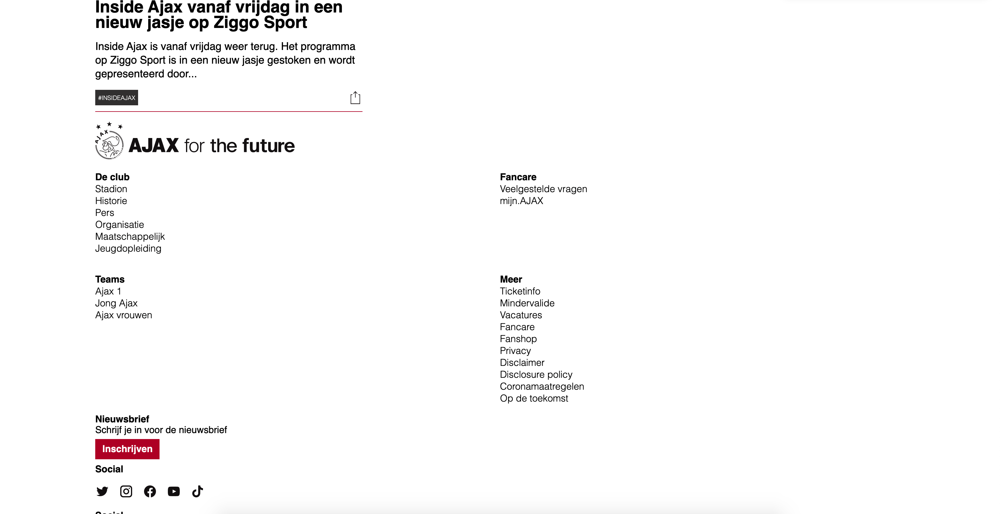

# Procesverslag
**Auteur:** Walter van Koesveld

Markdown cheat cheet: [Hulp bij het schrijven van Markdown](https://github.com/adam-p/markdown-here/wiki/Markdown-Cheatsheet). Nb. de standaardstructuur en de spartaanse opmaak zijn helemaal prima. Het gaat om de inhoud van je procesverslag. Besteedt de tijd voor pracht en praal aan je website.

## Bronnenlijst
1. -bron 1-
2. -bron 2-
3. -...-

## Eindgesprek (week 7/8)

-dit ging goed & dit was lastig-

**Screenshot(s):**

-screenshot(s) van je eindresultaat-

## Voortgang 3 (week 6)
Meer gebruik gemaakt van selectoren.

## Voortgang 2 (week 5)

Ik heb last van classerites, deze moet ik er uit werken en ik moet meer met selectoren werken.

## Voortgang 1 (week 3)

Goed bezig wel vaart maken met de detailpagina, liep vast met de achtergrond van 1 van de 'kaarten' op de homepagina. Deze wilde niet mee schalen, na een tijdje kloten die toch wel werkend gekregen.

### Stand van zaken

### Agenda voor meeting

### Verslag van meeting

## Intake (week 1)

**Je startniveau:** Ik zit een beetje tussen rood en blauw denk ik, ik vind het lastig om te beginnen maar als ik het eenmaal een beetje door heb dan vind ik het wel leuk en wil ik me er verder in verdiepen

**Je focus:** -Responsive-

**Je opdracht:** -De website die ik wil gaan namaken is die van Ajax (ajax.nl) -

**Screenshot(s):**

**Breakdown-schets(en):**

