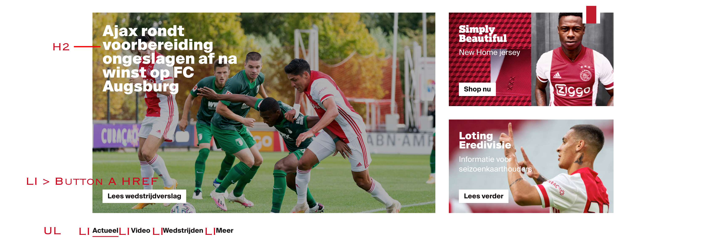

# Procesverslag
**Auteur:** Walter van Koesveld

Markdown cheat cheet: [Hulp bij het schrijven van Markdown](https://github.com/adam-p/markdown-here/wiki/Markdown-Cheatsheet). Nb. de standaardstructuur en de spartaanse opmaak zijn helemaal prima. Het gaat om de inhoud van je procesverslag. Besteedt de tijd voor pracht en praal aan je website.

## Bronnenlijst
1. -bron 1-
2. -bron 2-
3. -...-

## Eindgesprek (week 7/8)

-dit ging goed & dit was lastig-

**Screenshot(s):**

-screenshot(s) van je eindresultaat-

## Voortgang 3 (week 6)

-same as voortgang 1-

## Voortgang 2 (week 5)

Minder gebruik maken van classes, maak gebruik van een grid bij de footer.

## Voortgang 1 (week 3)

Goed bezig wel vaart maken met de detailpagina

### Stand van zaken

-dit ging goed & dit was lastig-

**Screenshot(s):**

-screenshot(s) van hoe ver je bent-

### Agenda voor meeting

-samen met je groepje opstellen-

### Verslag van meeting

-na afloop snel uitkomsten vastleggen-

## Intake (week 1)

**Je startniveau:** Ik zit een beetje tussen rood en blauw denk ik, ik vind het lastig om te beginnen maar als ik het eenmaal een beetje door heb dan vind ik het wel leuk en wil ik me er verder in verdiepen

**Je focus:** -Responsive-

**Je opdracht:** -De website die ik wil gaan namaken is die van Ajax (ajax.nl) -

**Screenshot(s):**

**Breakdown-schets(en):**

